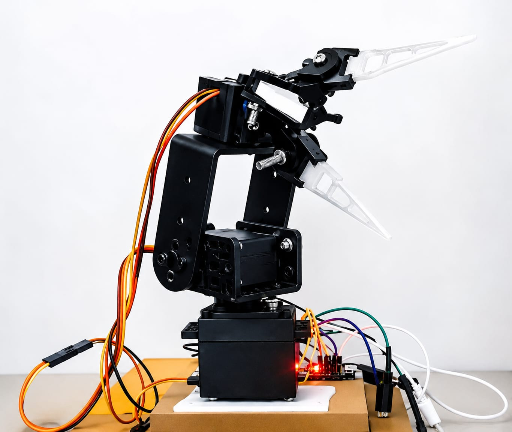

# 🤖 Contactless Gesture-Controlled Robotic Gripper

A **professional-grade, AI-driven robotic teleoperation system** that enables **zero-touch control** of a robotic gripper using real-time computer vision.

---

## 📸 Project Prototype


<p align="center">
  
</p>

---

# 🚀 Overview

The **Contactless Gesture-Controlled Robotic Gripper** is a hardware-agnostic robotic control solution designed for **sterile**, **hazardous**, and **remote operation** environments.

Instead of using conventional joysticks or physical controllers, the system tracks the user's hand in real time using **MediaPipe** and translates gestures into commands for an ESP32-controlled robotic gripper.

---

# ✨ Key Features

- 🤖 **AI Vision Processing** using Google's MediaPipe (21 hand landmarks)
- ⚡ **Ultra-Low Latency** (<50 ms) communication through WebSockets
- 📡 **Wireless ESP32 Communication**
- 🦾 **3D Printed Concentric Gear Gripper**
- 🔋 **Dual Power Supply Architecture** for reliable operation
- 📷 **Real-Time Hand Tracking** using OpenCV
- 🧠 Contactless Human-Robot Interaction

---

# 🛠️ Technical Stack

| Category | Technology |
|-----------|------------|
| Vision | OpenCV, MediaPipe |
| Programming | Python |
| Microcontroller | ESP32 NodeMCU |
| Communication | WebSockets (Asyncio) |
| Hardware | MG995 Servo, SG90 Servo |
| IDE | Arduino IDE |

---

# ⚙️ Setup Instructions

## 1️⃣ Prerequisites

Install **Python 3.10+** and then install the required libraries.

```bash
pip install opencv-python mediapipe websockets numpy
```

---

## 2️⃣ Running the Control Server

Navigate to the project folder.

Open:

```
src/mainserver.py
```

Locate the following variable:

```python
SERVER_IP = "YOUR_LOCAL_IP"
```

Replace it with your computer's local IP address.

To find your IP address (Windows):

```bash
ipconfig
```

Start the Python server:

```bash
python src/mainserver.py
```

---

## 3️⃣ Firmware Upload (ESP32 Side)

Open the Arduino IDE.

Open the firmware file:

```
firmware/esp32_mainserver/esp32_mainserver.ino
```

Update your Wi-Fi credentials:

```cpp
const char* ssid = "YOUR_WIFI_NAME";
const char* password = "YOUR_WIFI_PASSWORD";
```

Update the server IP:

```cpp
const char* server_ip = "YOUR_LOCAL_IP";
```

Select:

```
Tools → Board → ESP32 Dev Module
```

Select the correct COM Port:

```
Tools → Port → COMx
```

Finally click **Upload**.

---

## 4️⃣ System Start-up Sequence

Follow these steps in order:

1. Connect power to the ESP32.
2. Wait for it to connect to Wi-Fi.
3. Start the Python server.

```bash
python src/mainserver.py
```

4. Wait until the terminal displays:

```
Connection Established
```

5. Point your webcam toward your hand.

6. The robotic gripper is now ready to respond to your hand gestures.

---

# 🏗️ System Architecture

```
              Webcam
                 │
                 ▼
      OpenCV + MediaPipe
                 │
                 ▼
        Python Control Server
                 │
        WebSocket Communication
                 │
                 ▼
           ESP32 NodeMCU
                 │
        PWM Servo Signals
                 │
                 ▼
        Robotic Gripper
```

### Power Distribution

- **Logic Circuit:** Independent regulated power supply for ESP32 and communication.
- **Actuator Circuit:** High-current supply dedicated to servo motors.
- **Grounding:** Shared common ground for reliable PWM signal transmission.

---

# 📂 Project Structure

```text
Contactless-Robotic-Gripper/
│
├── assets/
│   └── prototypeimage.jpeg
│
├── firmware/
│   └── esp32_mainserver/
│       └── esp32_mainserver.ino
│
├── src/
│   ├── mainserver.py
│   └── hand_tracking.py
│
├── README.md
└── requirements.txt
```

---


---

# 🌟 Future Improvements

- Multiple gesture recognition
- Dynamic gesture training
- Mobile application support
- Cloud monitoring
- Voice command integration
- Robotic arm extension

---

# 👨‍💻 Developer

**Rohit Ahirwar**


---

## ⭐ Support

If you found this project useful, consider giving it a **⭐ Star** on GitHub.

---

<p align="center">
Made with ❤️ using Python, OpenCV, MediaPipe and ESP32.
</p>
